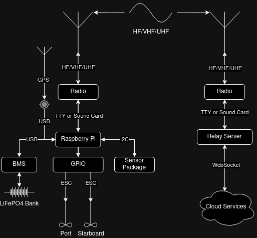

# System Design and Protocol Specification

This is simple architecture document for a sensor and control system for the [Yeah Buoy!](https://github.com/ptwohig/yeah-buoy-sim/) project. The intended firmware is running an embedded Linux connected to a controller using WiFi. The on board package will monitor data from three-axis accelerometers, gyroscopes, magnetic compass, and GPS to report position and sea state data. Additionally, the sensor package will assist in the navigation by providing positional data allowing the motor controller to control the thrusters accurately.



## Required Equipment

* [Raspberry Pi 5](https://www.raspberrypi.com/products/raspberry-pi-5/)
* [Waveshare Sense HAT-C](https://www.robotshop.com/products/waveshare-sense-hat-c-raspberry-pi-onboard-multi-powerful-sensors?gad_source=1&gclid=CjwKCAiArKW-BhAzEiwAZhWsIBp8Ncr_MnKHPOBFXKPUKIF6s_XNBIpILk9LakZpbOKqAQfBjFxDOBoCSmYQAvD_BwE)
* [VK-162 GPS Receiver](https://www.pishop.us/product/gps-antenna-vk-162/)
* [2x APISQUEEN 7.5kg Thruster](https://www.underwaterthruster.com/products/u5-12v-24v-7kg-thrust-brushless-underwater-thruster-propeller-propulsion-with-bi-directional-control-esc-for-rov-and-boat)
* [2x APISQUEEN 45A Electronic Speed Controller](https://www.underwaterthruster.com/products/apisqueen-12-24v-3-6s-lipo-45a-bi-directional-esc-to-control-brushless-motors-propellers-in-forward-or-reverse-rotation)
* [SeaView Cable Seal](https://www.westmarine.com/seaview-cable-seals-20702601.html)
* [Daly Smart BMS 8S](https://bmsdaly.com/collections/smart/products/daly-smart-bms-lfp-4s-7s-8s-16s-20s-24s-li-ion-3s-7s-13s-14s-16s-20s)

## Hardware Notes

The following re the notes on the selected hardware for the buoy, taking hardware limitations into design.

### Raspberry Pi 5

The Raspberry Pi 5 was selected for it's ease of use, availability of software, hardware add-ons, cost, and versatility. It is capable of running Embedded Linux and has low power draw making software development comparatively easy.

Other features which make the Rapsberry Pi a good choice:
* **Onboard Sound Card** - It is possible to use the sound card output as a way to generate HF, VHF, and UHF modulated signals using a tool like [Dire Wolf](https://github.com/wb2osz/direwolf). The frequencies required for low-speed data transmission are well within the sampling rate of the onboard sound card and the programming interface is relatively simple.
* **USB Ports** - The USB ports can be used to interface with a radio using a TTY/Serial connection to send data through a protocol like [DMR](https://www.dmrassociation.org/dmr-standards.html) or [DStar](https://www.icomamerica.com/lineup/amateur/D-STAR/)
* **Low Power Consumption at Idle** - At idle, the raspberry pi uses very low power and adjustments for sample rate of sensors give the software a great deal of control over how 

### Waveshare Sense HAT-C

The Wavesense HATC has support for the necessary positional sensors. The specifications indicate that it uses I2C for communication with the board and does not use GPIO. Therefore, the remaining GPIO pins are suitable for use with thruster control. The specifications document indicates that he following I2C addresses are used by the sensor package.

| Address    | Sensor                   | Notes                   |
| ---        | ---                      | ---                     |
| ```0x6B``` | Motion Sensor            | Required for Navigation |
| ```0x0C``` | Magnetometer             | Required for Navigation |
| ```0x70``` | Temperature and Humidity | Humidity not Reliable   |
| ```0x0C``` | Barometric Pressure      | Unsure if Reliable      |
| ```0x48``` | ADC                      | Not Used                |
| ```0x29``` | Color Sensor             | Not Used                |

### VK-162 GPS Receiver

This is a simple USB GPS receiver. Though plastic tens to be radiotransparent, the ability to route the cable to the outside would maximize the accuracy of the received signal. This could easily be replaced with a similar part from another manufacturer.

### Thrusters and ESC

These thrusters can be thru-bolted to the bottom of the barrel and sealed with 3M 5200 or Sikaflex against the bottom. A plastic backing plate may be necessary along with a sealed pass through for the wire.
  
The ESC (Eletronic Speed Control) modules appear to be a MOSFET or similar inline transistor package which can control motor RPMs using pulse width modulation (PWM). The algorithm currently only uses forward for navigation, but they are reversible and could be used in back down situations where the buoy can detect problems such as kelp entanglement.

### SeaView Cable Seal

A simple and affordable cable pass-through for wires. Can be used for both signal and control wires. May options exist but this provides a watertight seal between the inside and outside of the buoy.

### DalyBMS 8S

The DalyBMS is an 8S (8 Series) LifePO4 capable Battery Management System. It is capable of communicating with a computer via USB-CAN or USB-UART bridge. This allows the onboard computer to monitor battery state and set alersts/alarms if power is running low or batteries are malfunctioning.

The BMS Is critical for safe operation of Lithium batteries.

# Network Protocol

The buy will report on a fixed interval regular sensor data. The interval can be adjusted at deployment time based on requirements. The protocol is a datagram based protocol and can be used over a variety of communication methods.

The protocol is intended to be used on low-bandwidth connections with flags and options for security such as using HMAC-256 to secure communication.

This specification covers Version 1.0 of the Protocol.

## Datagram Header

All datagrams share a common header, regardless as to whether they are sent from client or server. Unless otherwise specified, assume all traffic is in [Network Byte Order](https://en.wikipedia.org/wiki/Endianness) otherwise known as "Big Endian" with the most significant byte first.

| 8 Bits        | 8 Bits        | 8 Bits      | 8 Bits      |
| ---           | ---           | ---         | --          |
| Version Major | Version Minor | Opcode      | Opcode      |
| Priority      | Flags         | Flags       | Flags       |
| CRC32         | CRC32         | CRC32       | CRC32       |
| Length        | Length        | Length      | Length      |

### Version

The first two bytes of every datagram will begin with the version for now and all future version of the protocol. The versions follow [Semantic Versioning](https://semver.org/) rules, omitting the revision field.

* Major - Changes only when the protocol is not backwards compatible with all previous minor version.
* Minor - Changes when new opcodes are added to the protocol. But will not break existing code.

In cases where either end does not support an opcode, then the message will be ignored. For debugging, implementation should log the error condition.

For clarity, the version indicates when the opcode was introduced to the protocol and, unless the opcode undergoes a revision, the version will be fixed to that value.

### CRC32

This is a standard CRC-32 checksum of the datagram. This encompasses the entire  from the beginning byte (Version Major) including header length plus bytes. If the CRC-32 is present and does not match, then the receiver must reject the message. It should reject the dubious message.

This section is not present if the flag is not enabled.

### Opcode 

The opcode is an enumeration of all opcodes supported by the protocol. The same format is used for either end and there is no a formal designation as to what is a "Client" and what is a "Server" datagram.

The Opcodes section of this document cover the opcodes in detail, including which versions of the protocol support the opcodes.

### Priority

A priority byte with range 0x00 -  0xFF. With zero being the highest priority. A zero-priority message should be sent immediately without regard for buffering or delay.

The following priorities should be used as general guidelines for shaping messages.

* 0x00 - Highest Priority. Indicates major emergency requiring immediate attention and should be sent immediately.
* 0x0F - Normal Priority. Datagrams with this priority and lower being candidates for buffering
* 0xFF - Lowest priority.

### Flags

Flags are a 24-bit mask for enabling various flags. At the time of this writing, not all bits are used but will be used in future revisions as the protocol develops.

Disabling certain flags can save bytes in transmissions, especially in circumstances where the datalink protocol provides the required functionality (such as a CRC-32 built in to AX.25 or TCP).

#### Version 1.0

* **0x0001** - Enables CRC32 section of the header.
* **0x0002** - Enables [HMAC-256](https://en.wikipedia.org/wiki/HMAC) footer.

### Length

The length is a 32-bit unsigned integer with value of 0x0000 - 0xFFFF. Practically speaking, it would not make sense to send a datagram this large as the protocol is designed for use on low-bandwidth connections. However, this should permit sufficient space for virtually all conceivable datagrams.

The length indicates the number of bytes read past the end of the header and does not include the header itself.

In the event the message supports the HMAC-256 footer, the footer length will not be included in the length calculation. Nor will the CRC-32 consider the HMAC-256 footer signature.

## HMAC-256 Footer

The HMAC-256 footer is an optional past-the-end of the message footer which can be used to verify the sender of a message. HMAC-256 enables the sender and receiver to verify authenticity using a shared secret key. It also doubles as an additional integrity check. This adds significant overhead (32 bytes).

| 8 Bits        | 8 Bits        | 8 Bits      | 8 Bits      |
| ---           | ---           | ---         | --          |
| HMAC-256      | HMAC-256      | HMAC-256    | HMAC-256    |
| HMAC-256      | HMAC-256      | HMAC-256    | HMAC-256    |
| HMAC-256      | HMAC-256      | HMAC-256    | HMAC-256    |
| HMAC-256      | HMAC-256      | HMAC-256    | HMAC-256    |
| HMAC-256      | HMAC-256      | HMAC-256    | HMAC-256    |
| HMAC-256      | HMAC-256      | HMAC-256    | HMAC-256    |
| HMAC-256      | HMAC-256      | HMAC-256    | HMAC-256    |
| HMAC-256      | HMAC-256      | HMAC-256    | HMAC-256    |

When receiving a message that has the HMAC-256 footer enabled, the receiver must reject the message if the footer does not match. The receiver should log the dubious message.

## Opcodes and Datagrams

### Version 1.0

This section indicates all opcodes in messages. This section indicates which end (client or server) will handle the message. For the purposes of clarity, we consider the buoy the client, and the control operator the server.

#### No-Op 0x00

This is a datagram indicating a no-op. This could be sent as a keep alive message on networking protocols which require it. In all cases the receiver must do nothing with the message and should log it.

| 8 Bits        | 8 Bits        | 8 Bits      | 8 Bits      |
| ---           | ---           | ---         | --          |
| 0x1           | 0x0           | 0x0         | 0x0         |
| Priority      | Flags         | Flags       | Flags       |
| CRC32         | CRC32         | CRC32       | CRC32       |
| 0x0           | 0x0           | 0x0         | 0x0         |

#### Navigate 0x01

This is a datagram indicating that the buoy should update the skyhook to a new set of GPS coordinates. The control station sends this message to the buoy and it will begin navigation to the assigned location.

| 8 Bits        | 8 Bits        | 8 Bits      | 8 Bits      |
| ---           | ---           | ---         | --          |
| 0x1           | 0x0           | 0x0         | 0x1         |
| Priority      | Flags         | Flags       | Flags       |
| CRC32         | CRC32         | CRC32       | CRC32       |
| 0x0           | 0x0           | 0x0         | 0x10        |  
| Latitude      | Latitude      | Latitude    | Latitude    |
| Latitude      | Latitude      | Latitude    | Latitude    |
| Longitude     | Longitude     | Longitude   | Longitude   |
| Longitude     | Longitude     | Longitude   | Longitude   |

* **Latitude** - The North Latitude of the requested destination.
* **Longitude** - The East Longitude of the requested destination.

#### Location 0x02

This is a datagram indicating the current position of the buoy. The current position should be sent with a higher than normal priority when current navigating, and when within the target longitude and longitude, should be sent with normal or lower priority.

| 8 Bits        | 8 Bits        | 8 Bits      | 8 Bits      |
| ---           | ---           | ---         | --          |
| 0x1           | 0x0           | 0x0         | 0x2         |
| Priority      | Flags         | Flags       | Flags       |
| CRC32         | CRC32         | CRC32       | CRC32       |
| 0x0           | 0x0           | 0x0         | 0x18        |
| Latitude      | Latitude      | Latitude    | Latitude    |
| Latitude      | Latitude      | Latitude    | Latitude    |
| Longitude     | Longitude     | Longitude   | Longitude   |
| Longitude     | Longitude     | Longitude   | Longitude   |
| Timestamp     | Timestamp     | Timestamp   | Timestamp   |
| Timestamp     | Timestamp     | Timestamp   | Timestamp   |

* **Latitude** - The North Latitude of the requested destination. 64-bit double precisions floating point number.
* **Longitude** - The East Longitude of the requested destination. 64-bit double precisions floating point number.
* **Timestamp** - The timestamp, expressed in milliseconds from the [UNIX Epoch](https://en.wikipedia.org/wiki/Unix_time) (January 1, 1970). 64-bit signed integer.

#### Sea State 0x03

This is a datagram indicating the sea state as recorded by the buoys onboard sensor package. The sea state is the wave height measured by the onboard sensor package.

| 8 Bits        | 8 Bits        | 8 Bits      | 8 Bits      |
| ---           | ---           | ---         | --          |
| 0x1           | 0x0           | 0x0         | 0x3         |
| Priority      | Flags         | Flags       | Flags       |
| CRC32         | CRC32         | CRC32       | CRC32       |
| 0x0           | 0x0           | 0x0         | 0x04        |
| Wave Height   | Wave Height   | Wave Height | Wave Height |

* **Wave Height** - The height of the waves, expressed in meters.

##### Notes on Priority

Please refer to the [Beaufort Scale](https://www.weather.gov/pqr/beaufort) for the meaning of wave height. The buoy's mechanical design is to tolerate "Near Gale" conditions. At the time of this writing, it has not been tested in real world scenarios and only in virtual simulations and this specification will likely be revised in the future.

* **Beaufort 0 - 7** - Normal or lower priority
* **Beaufort 8 - 11** - Higher than normal priority.
* **Beaufort 12** - Don't be surprised if it sinks.

#### Error 0x04

This is a datagram indicating that the buoy detected some sort of error condition. For example, if one or more thruster has wrapped kelp or other jetsam.

| 8 Bits        | 8 Bits        | 8 Bits      | 8 Bits      |
| ---           | ---           | ---         | --          |
| 0x1           | 0x0           | 0x0         | 0x4         |
| Priority      | Flags         | Flags       | Flags       |
| CRC32         | CRC32         | CRC32       | CRC32       |
| 0x0           | 0x0           | 0x0         | 0x0C        |
| Code          | Code          | Code        | Code        |
| Timestamp     | Timestamp     | Timestamp   | Timestamp   |
| Timestamp     | Timestamp     | Timestamp   | Timestamp   |

* **Code** - A 32-bit code indicating the cause of the failure. A zero indicates that no codes are present.
* **Timestamp** - The timestamp, expressed in milliseconds from the [UNIX Epoch](https://en.wikipedia.org/wiki/Unix_time) (January 1, 1970). 64-bit signed integer.

##### Notes on Priority

* When no errors are present, the buoy should send this message regularly in order to indicate no errors are present. Additionally, the regular propulsion errors should be sent at low priority and sent sparingly.
* When there is a transition from an error to non error state, these message should be sent at higher than normal priority. Additionally, the error-positive states should be sent with higher regularity than negative error states.
 
#### SoC/SoH (State of Charge / State of Health) 0x05

This Datagram indicates the buoy's state of charge and State of Health. Escalating priority in the event that the battery is low. State of Health is the ratio of the battery's actual capacity to it's rated max capacity as specified by the manufacturer. As the battery wears out, the SoH slowly degrades as the battery loses its ability to take charge. State of Charge is the ratio of charge remaining to the state of health. Over time and as a battery wears out a "100%" state of charge results in fewer watt hours availble to the system. A modern BMS can monitor these conditions and indicate when the cells require a replacement.

| 8 Bits        | 8 Bits        | 8 Bits      | 8 Bits      |
| ---           | ---           | ---         | --          |
| 0x1           | 0x0           | 0x0         | 0x4         |
| Priority      | Flags         | Flags       | Flags       |
| CRC32         | CRC32         | CRC32       | CRC32       |
| 0x0           | 0x0           | 0x0         | 0x0C        |
| SoC Value     | SoC Value     | SoH Value   | SoH Value   |
| Timestamp     | Timestamp     | Timestamp   | Timestamp   |
| Timestamp     | Timestamp     | Timestamp   | Timestamp   |

* **SoC Value** - A 16-bit unsigned integer indicating SoC reading, relative to SoH
* ** SoH Value** - A 16-bit unsigned integer indicating SoH reading.
* **Timestamp** - The timestamp, expressed in milliseconds from the [UNIX Epoch](https://en.wikipedia.org/wiki/Unix_time) (January 1, 1970). 64-bit signed integer.

##### How to interpret the SoC and SoH values

The absolute max reference is the maximum value of an unsigned 16-bit integer (65,535 / 0xFFFF). Regardless as to how the BMS reports this value, the buoy's control software must calculate both values using that value.

* % Battery Life Remaining = SoC / SoH
* % Battery Health Remaining = SoH / 0xFFFF

##### Notes on Priority


* When Over 80% SoC remaining this datagram should be sent at normal or lower priority, regularly, and at low intervals.
* when Under 20% SoC remaining this datagram should be sent at higher than normal priority and sent immediately and with greater frequency.

# Datalink Architecture

The application protocol for the buoy is intended to be agnostic to the datalink used. Since it is intended for offshore communications, it may be possible control using a variety of protocols including VHF/UHF, HF, and Wireless. For Ham radio based protocols, particular attention must be paid to to the FCC rules involving licensed communication. Specifically, encryption must not be used and use of bandwidth must be in accordance with "good amateur practices."

This outlines considerations for each Datalink strategy.

## AX.25

[AX.25](https://en.wikipedia.org/wiki/AX.25) is a protocol which supports a 300 baud symbol rate over amateur radio frequencies. It supports VHF/UHF as well as HF modes. Builtin to the protocol is addressing by callsign and CRC-32. Therefore, when using the Yeah Buoy protocol over AX.25 it would make sense to disable the CRC-32 commands. It would further be useful to disable the HMAC-256 for all commands, except those to control the buoy's location.

### Buffering on AX.25

Normal and lower priority messages should be buffered on AX.25 and sent on bulk intervals. Additionally, in accordance with best amateur practices, the messages should be sent at intervals which do not over-saturate the selected band.

* **No-Op** - 128 bits or approximately 0.42 seconds (.32 with CRC disabled).
* **Navigate** - 256 bits or approximately 0.85 seconds (.75 with CRC disabled)
* **Location** - 320 bits or approximately 1.05 seconds (0.96 with CRC disabled).
* **Sea State** - 160 bits or approximately 0.53 seconds (0.42 seconds with CRC disabled)
* **Propulsion Error** - 160 bits or approximately 0.53 seconds (0.42 seconds with CRC disabled)

Note, none of the above estimations include AX.25 protocol overhead or time it takes to transmit under poor radio conditions.

## TCP

On WiFi and similar networks the transmission time is trivial. It is advantageous to batch several minutes worth of messages. A bridge from radio to WiFi to cloud for long term data storage could relay or enable bidirectional communication over Websockets.

# Buoy to Cloud Connection

Since the buoy can serve multiple purposes, including reporting wave height and radio propagation information, it will ultimately be possible to connect the buoy to a cloud service to log the data it records and drive alerts to error and warning conditions.

## Websockets

The shoreside monitoring station consists of a relay server which receives and parses the datagrams per the protocol specification. Upon successful verification, such as HMAC and/or CRC32, the relay server will upload the datagrams to a server via websocket.

Additionally, while connected to the cloud, the relay server will buffer and forward any messages to the buoy over the designated frequency. On the remote instance, the cloud server must perform additional checks.

## Shared Secret

For a majority of commands, there should only be simple data integrity checks, such as CRC32. However, commands like repositioning or updating the navigational target MUST use HMAC-256 and a shared secret to ensure that only the designed control operator may move the buoy.

A shared secret is a secret string of bytes which combined with the HMAC will ensure that the requested opcode comes from the designated control operator. The shared secret will never be transmitted on the radio and must be determined before the buoy leaves the dock.

If the shared secret becomes compromised, it will require physical retrieval of the buoy and resetting of the shared secret.