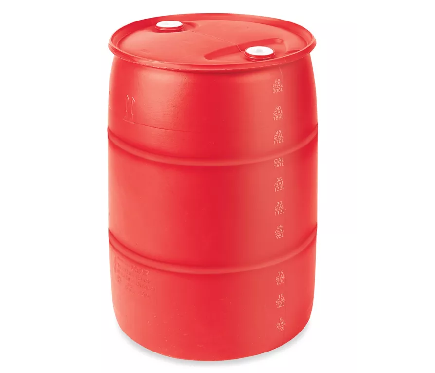

# Yeah Buoy - Simulator

Yeah Buoy! Is my open source ROV project. It was inspired by the desire to set marks for sailboat racing in deep water where it may not be possible to set a mark using traditional anchor and rode. The buoy's control software is designed to stay on a fixed location indefinitely until it is either retrieved, or its location updated. The ultimate goal is to use the code for the simulator and build the buoy which can be controlled by simple and inexpensive thrusters attached to a battery bank. The simulation is built with Unity6 using the BIRP (Built-In Rendering Pipeline).

Though originally inspired for regattas, this could be used for any number of purposes where it may be desirable to have a buoy which can hold a position indefinitely. Such uses could include gathering of wave height data, wind conditions, oceanographic research, climate analysis and much more. The control system is intended to be simple with basic inputs which could be controlled via SSB radio (eg Ham or Marine SSB).

Ultimately, the goal of this project would be to publish actual firmware and CAD drawings of parts which could be easily and quickly fabricated into an operational buoy.

# Features

The simulation attempts to reproduce, as accurately as possible, realistic condition which the buoy would face in deep water. This allows for easy and rapid testing of control system algorithms to fine tune the buoy without needing to build anything or risk loss of equipment or property damage during testing.

* Adjustable wave height and sea states to accurately determine how the drone performs in adverse conditions.
* Controller input support for testing.
* Navigation algorithm which uses a PID to control angular velocity based on trim.
* Physical characteristics of an actual buoy with correct center of mass calculation, including weight of equipment and batteries.
* Simulated windage based on an approximation wind and waves.
* Battery usage simulator which includes state of charge and parasitic draws from onboard communications and navigational equipment.
* GPS Error simulation to test real-world conditions.
* Sound effects for motor spin and other features.
* Simulators for orientation sensors typically used in robotics which includes a tree-axis accelerometer, three axis gyroscope, and magnetic compass.
* Gizmos on all objects indicating the parameters so you can visualize the navigation algorithm.

# Navigation Algorithm

The Navigation algorithm is simple and designed to be controlled by two thrusters ont he bottom of the buoy. For simplicity, they operate in forward mode only and allow the buoy to spin by adjusting a trim value.

The basic procedure is as follows:
 * The buoy throttles up to full motor RPMs over the course of a pre-determined time (defaults to 2.0 seconds)
 * One at full throttle, the buoy will use the GPS fix do draw a vector towards the target mark position.
 * The buoy will operate at full throttle until it finds the outside perimeter of the target location.
 * The buoy will target a specific angular velocity based on how far off of a zero heading to the target using a PID algorithm.
 * The PID algorithm will feather the trim as it approaches the mark. Trim simply reduces motor RPM on either port or starboard side to achieve the desired angular velocity as the buoy approaches the mark.
 * Once the buoy reaches the outside target perimeter, it will begin to throttle the engines down to zero until it lands within the target perimeter.
 * Once the buoy drifts outside the maximum perimeter, the algorithm starts over from a full throttle up operation.

In order to conserve power and hold location to mark, the control software will avoid running the motors as much as possible and only re-start navigation if the buoy drifts far outside of the perimeter.

# Built in Physical Characteristics

As this project develops, there will likely add more buoy types and will add them as they are developed.

## 55 Gallon Drum Buoy

Included in this package is a buoy is based on a standard 55 Gallon Drum.
* Mass is calculated to standard barrel sizes for a rotomolded 55 gallon drum.
* Ballast is assumed to be an 8000 watt-hour Lifep4 battery bank anchored to the bottom of the barrel.
* Thruster engines are two small 800 watt ROV motors

# Credits and Attributions

The project uses the following projects. Many thanks to those who have put the time and hard work into making this possible.

*  [Crest](https://github.com/wave-harmonic/crest) - Definitely check this one out. The project is an ocean simulator which can simulate a variety of sea states and includes support for wind.
* [Dynamic Water Physics 2](https://assetstore.unity.com/packages/tools/physics/dynamic-water-physics-2-147990) - An excellent plugin which simulates water vehicle mechanics. It's extremely easy to use and the developer is very helpful in Discord. I highly recommend this project.
* [OD1 55 Gallon Plastic Barrels](https://assetstore.unity.com/packages/3d/props/industrial/od1-55-gal-industrial-plastic-barrels-53462) - Great models for barrels.

# License

This is licensed as [AGPL 3.0](LICENSE.txt). I am happy to re-license this code to Apache 2.0 for a fee or as part of consulting work. Additionally, I will re-license (at no fee) for the following entities and organizations (at my discretion):

* 501c3 Corporations participating in climate research, oceanography, or other charitable causes.
* Independent game developers.
* People I like.
